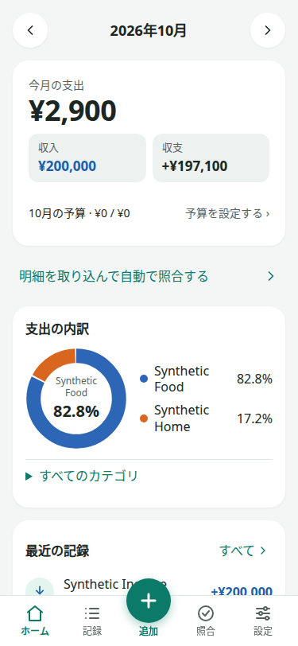
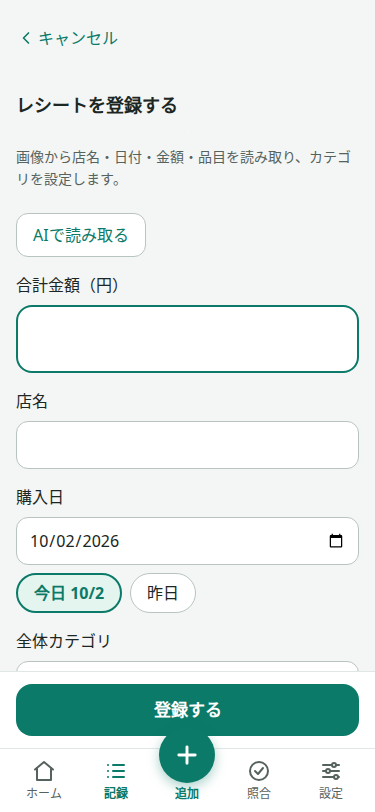
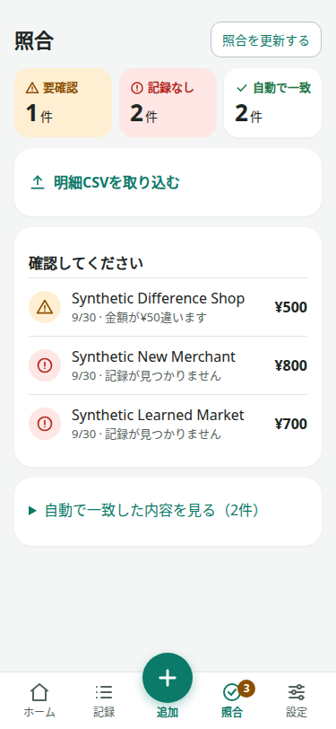
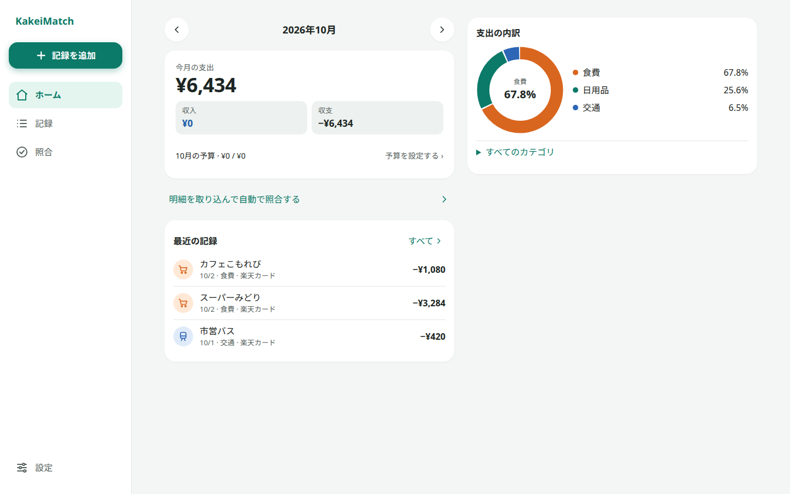
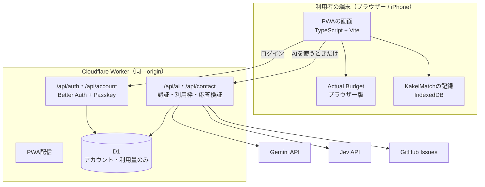

# KakeiMatch

**レシートを撮るだけで家計簿に記録し、後から届くカード明細と自動で突き合わせる家族向けPWAです。**

一致した取引は自動で片付け、人が見るのは「金額が違う」「記録が見つからない」など判断が必要なものだけにします。家計データは利用者の端末に保存し、サーバーへ預けません。端末間同期を利用者が明示的に有効にした場合だけは例外にする設計ですが、現時点では利用できません。

- 本番アプリ: <https://kakeimatch.yhgry.workers.dev>（AI機能の利用には招待制のアカウントが必要です）
- 対応環境: iPhoneのSafari（ホーム画面に追加して使用）を主な対象とし、PCのブラウザーにも対応しています

  
  
  

スクリーンショットはすべて合成データです。

## 作った理由

家計簿をつけるときの負担は、レシートの入力だけではありません。入力した後、後日届くクレジットカードや決済サービスの明細と1件ずつ突き合わせ、金額の違いや記録漏れを探す作業が残ります。

家計簿アプリは記録や集計には優れています。しかし「レシートで記録した支出」と「後日届くカード明細」の照合は、人の手に残りがちです。KakeiMatchは、この照合作業を減らすために作りました。

### 目指したこと

1. **レシートから楽に記録できる**: 撮影した画像から店名・日付・金額・品目を読み取り、カテゴリも提案します
2. **カード明細と自動で照合できる**: カード会社のサイトから取得したCSVを取り込み、家計簿の記録と突き合わせます
3. **人には要確認だけを見せる**: 正しく一致した取引は表に出さず、判断が必要なものだけを示します

OCRの精度100%は目指していません。成功の基準は機能の数ではなく、家計簿と照合にかかる手作業がどれだけ減るかです。また、記録のない明細を「不正利用」とは呼びません。レシートの紛失、オンライン決済、利用日と計上日のずれなど、正当な理由が多いためです。

## 主な機能

### 記録する

- **レシート登録**: 画像から店名・日付・合計金額・品目をAIで読み取ります。AIを使わない手入力もできます
- **カテゴリ提案**: 品目ごとにカテゴリを提案します。利用者が修正した履歴を端末内で学習し、次回から優先します
- **手入力**: 収入・支出・口座間の振替を登録できます。品目を分けて、カテゴリ別に金額を配分することもできます
- **定期登録**: 家賃や給与など、毎月・毎週・毎年の固定収支を自動で登録します
- **編集・削除**: 登録後に品目やカテゴリを修正でき、変更履歴が残ります。削除は10秒間取り消せます

### カード明細と照合する

- **明細CSVの取り込み**: 次の形式に対応しています。CSVは端末内で処理し、AIやサーバーへ送りません

  | カード | 対応範囲 |
  | --- | --- |
  | PayPayカード | PayPayクレジットの1回払い |
  | 三井住友カード（Vpass） | 通常の1回払い |
  | 楽天カード | 通常の1回払い |

- **自動照合**: 日付・金額・店名から候補を探し、確実に一致したものは自動で処理します
- **要確認と記録なし**: 金額の違いや候補が複数ある取引は「要確認」に、対応する記録がない明細は「記録なし」に分け、画面の先頭に表示します。記録なしの明細は、その場で支出として登録できます
- **取り込みの重複防止**: 同じCSVを再度取り込んでも明細は増えません。分割払いなど対応範囲外の行は購入として登録せず、行番号と理由を示します

### 家計を見る

- 月ごとの収入・支出・収支と、カテゴリ別の内訳グラフ
- カテゴリ別の月予算と進み具合
- 口座ごとの残高
- 全期間の記録の検索・絞り込み（店名、メモ、品目名、期間、金額）

### データを守る

- **端末内保存とオフライン動作**: 家計データは端末に保存し、通信できない場所でも閲覧・記録できます
- **バックアップと復元**: 家計簿、レシート画像、明細を1つの `.kmb` ファイルに書き出し、別の端末で復元できます
- **安全な更新**: アプリ更新時も入力中の内容を保持します。端末内データの形式は、バージョンを判定してから移行します

### アカウントとサポート

- **Passkeyログイン**: パスワードを使わず、Face IDなどでログインします。アカウントはAI機能の利用時だけ必要です
- **AI利用枠**: 利用者ごとの月間利用回数と、サービス全体の費用上限を設けています
- **お問い合わせ**: 音声で入力でき、不具合や改善要望はGitHub Issueとして登録されます
- **アカウント削除**: 本人がアカウントを削除できます。端末の家計データは削除されません

## 設計で大事にしたこと

### 家計データを端末から出さない（local-first）

家計簿、レシート、明細、照合結果は利用者のブラウザー（IndexedDBとActual Budgetのブラウザー版）に保存します。サーバー側のデータベースには、本人確認、session、Passkey、AI利用量など、アカウントとAIの運用に必要な情報だけを保存します。アカウントにログインしていなくても、通信できなくても、AI以外の機能はすべて使えます。

唯一の例外として、設定の「端末間の同期」を利用者が明示的に有効にした場合だけ、端末で暗号化した家計簿の版を同期保存先（初期はKakeiMatch CloudのR2）へ置き、同期の認可・順序の制御情報をD1へ保存します。D1へ家計データの平文は保存せず、同期は初期状態でOFFです。本番の同期保存先はまだ設定していないため、本番アプリでは同期を有効にできません。詳細は[端末間同期](docs/DEVICE_SYNC.md)を参照してください。

AIに送る情報も絞っています。レシート画像は、利用者が「AIで読み取る」を選んだときだけ送ります。カテゴリ提案には、検証済みの店名、合計金額、最大30件の品目名と金額だけを送ります。

### AIと通常のコードを使い分ける

AIは曖昧さを含む処理だけに使います。

| 処理 | 担当 |
| --- | --- |
| レシート画像の読み取り | Gemini |
| 選択肢からのカテゴリ分類 | Jev（TypeSafe） |
| 明細の照合、重複判定、状態遷移、金額計算、認可 | 通常のTypeScriptコード |

AIの応答はZodのschemaで検証し、不正な応答は保存しません。金額は整数の円で扱い、浮動小数点を使いません。照合ロジックには、合成データの評価セット（`pnpm eval:reconciliation`）を用意しています。

### 解決済みの問題を作り直さない

家計簿の基盤には、オープンソースの[Actual Budget](https://github.com/actualbudget/actual)のブラウザー版を使っています。KakeiMatchは、レシート入力、AI分類、明細照合、スマートフォン向けの画面に集中しています。

### 費用と濫用を抑える

AIの利用はCloudflare Worker経由に限定し、APIキーをブラウザーに渡しません。利用者ごとの月間上限とレート制限に加え、サービス全体の日次・月次の費用上限を設けています。上限に達した場合や、障害が続いた場合はAIを自動で停止します。AIが止まっても、手入力と照合は使い続けられます。

## アーキテクチャ

アプリとAPIは1つのCloudflare Workerから同じoriginで配信します。ブラウザー内でActual Budgetを動かすため、WorkerはCOOP/COEPヘッダーを返します。Service Workerは `/api/*` をキャッシュしません。詳細は[アーキテクチャ](docs/ARCHITECTURE.md)を参照してください。

### 技術スタック

| 領域 | 使用技術 |
| --- | --- |
| フロントエンド | TypeScript（UIフレームワークなし）、Vite、PWA（Service Worker） |
| 家計簿エンジン | Actual Budget（`@actual-app/api` のブラウザー版） |
| 端末内保存 | IndexedDB、Actual Budgetのブラウザー内データ |
| サーバー | Cloudflare Workers、Cloudflare Vite Plugin、`cf` CLI |
| データベース | Cloudflare D1（アカウントとAI利用量のみ） |
| 認証 | Better Auth、Passkey（WebAuthn） |
| AI | Gemini API（レシート読み取り、文字起こし）、Jev（カテゴリ分類） |
| 検証・解析 | Zod、csv-parse |
| テスト | Vitest、Playwright（合成データによるブラウザーE2E）、GitHub Actions |

## セルフホスト

自分用のセルフホスト環境では、APIキーを用意する代わりに、ChatGPTのサブスクリプションの利用枠でAI機能を使えるようにする予定です。実験的な機能として[Issue #147](https://github.com/RyoyaYahagi/KakeiMatch/issues/147)で開発を進めています。

## ドキュメント

**プロダクトと設計**

- [プロダクト](docs/PRODUCT.md): 目的、MVP、対象外の機能
- [アーキテクチャ](docs/ARCHITECTURE.md): 本番構成とデータ境界
- [UX](docs/UX.md)と[デザイン](docs/DESIGN.md): 画面設計の方針
- [実装計画](docs/IMPLEMENTATION_PLAN.md): 現在の利用フローと残作業
- [セキュリティ](SECURITY.md): データとサービスの保護

**機能の仕様**

- [端末内の明細照合](docs/LOCAL_RECONCILIATION.md)と[明細形式](docs/STATEMENT_FORMATS.md)
- [カテゴリ修正履歴による分類](docs/LOCAL_CATEGORY_LEARNING.md)
- [カテゴリと支払元の管理](docs/LOCAL_MASTERS.md)
- [登録した記録の編集](docs/LOCAL_RECEIPT_EDITS.md)と[取引削除と取り消し](docs/LOCAL_TRANSACTION_DELETION.md)
- [口座間振替](docs/LOCAL_TRANSFERS.md)と[定期収入・定期支出](docs/LOCAL_RECURRING_TRANSACTIONS.md)
- [記録の検索・絞り込み](docs/LOCAL_TRANSACTION_SEARCH.md)
- [月次ダッシュボード](docs/LOCAL_MONTHLY_DASHBOARD.md)、[口座残高](docs/LOCAL_ACCOUNT_BALANCES.md)、[カテゴリ別月予算](docs/LOCAL_MONTHLY_BUDGETS.md)
- [Cloud account](docs/CLOUD_ACCOUNT.md): Passkey、AI利用、権限、D1
- [お問い合わせ](docs/CONTACT.md)と[端末内の診断](docs/LOCAL_DIAGNOSTICS.md)

**データと運用**

- [デプロイ](docs/DEPLOYMENT.md): 本番URL、preview、更新手順
- [AI費用の停止と再開](docs/AI_COST_GUARDRAILS.md)
- [バックアップと復元](docs/LOCAL_BACKUP.md)と[不完全復元の調査と停止](docs/ACTUAL_RESTORE_CLEANUP.md)
- [端末内データの構造変更](docs/LOCAL_DATA_MIGRATIONS.md)と[アプリ更新](docs/PWA_UPDATES.md)
- [暗号化クラウド保存の共通形式](docs/ENCRYPTED_HOUSEHOLD_STORAGE.md)（開発中）
- [端末間同期](docs/DEVICE_SYNC.md)（サーバー側の制御のみ実装。利用者には未提供）
- [ローカル利用フロー](docs/LOCAL_FIRST_FLOW.md): 合成データによるブラウザー・iPhoneでの確認状況
- [コントリビューション](CONTRIBUTING.md): ブランチとPull Requestの運用

## ライセンス

家計簿エンジンには[Actual Budget](https://github.com/actualbudget/actual)（MIT License）を使っています。著作権表示とライセンス全文は[THIRD_PARTY_NOTICES.md](THIRD_PARTY_NOTICES.md)にあります。

KakeiMatch本体は[MIT License](LICENSE)で公開しています。
