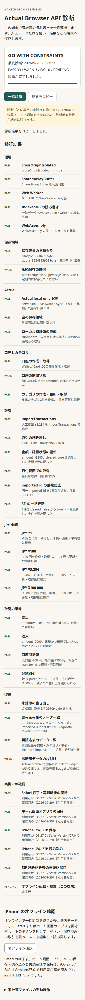

# Actual browser API 実現性検証（Issue #31）

## 技術判断

**GO WITH CONSTRAINTS（暫定）**。一括診断を Cloudflare 配信ページで実行した Chromium の結果は **PASS 33 / WARN 3 / FAIL 0 / PENDING 1** だった。PASS には、利用者が報告した iPhone 実機の 5 項目を含む。`persist()=false`、閉じた口座が `getAccounts()` に現れないこと、診断用家計簿の削除 API がないことが WARN、iPhone のオフライン起動・編集が PENDING である。iPhone 上の主要 API 個別結果と `crossOriginIsolated` の値は、まだコピーされた一括診断結果を受け取っていないため未確認である。サイトの暫定判定を最終決定とせず、これらの実機結果で再評価する。

## 検証環境と配信

| 項目 | 実測・設定 |
| --- | --- |
| 検証日 | 2026-09-29 |
| Actual package | `@actual-app/api` 26.9.0 の browser export |
| Cloudflare CLI | `cf` 1.0.0-beta.5 |
| 配信先 | https://kakeimatch-actual-browser-spike.yhgry.workers.dev/ |
| 配信方式 | `spikes/actual-browser/` の Vite 8.3.1 + Cloudflare Vite Plugin 1.62.0。`cloudflare.config.ts` と静的アセットを使用 |
| 自動試験ブラウザ | Playwright の Chromium 配布リビジョン 1243。User-Agent は `HeadlessChrome/153.0.0.0`。iOS や Safari ではない |
| iOS version | 27.0。利用者が iPhone の「設定」で確認した値（利用者報告） |
| Safari version | User-Agent の `Version/27.0`（利用者報告） |

`cf --help` と `cf cli search 'deploy a static assets worker project'` を確認した。実行した主な操作は `cf deploy --dry-run`、`cf deploy`。両方成功し、既存 Worker と同じ URL へ配信した。`wrangler` は直接実行していない。配信された HTML と `/sw.js` に対する `curl -I` では、どちらも `Cross-Origin-Opener-Policy: same-origin` と `Cross-Origin-Embedder-Policy: require-corp` を確認した。Cloudflare の `_headers` は静的アセットに適用され、Worker が生成する応答には適用されないため、将来 API 応答を追加する場合は別途ヘッダーが必要になる。[Cloudflare Headers (2026/09), Custom headers]

390 px 幅の Chromium で撮影した診断画面: 

## 一括診断の使い方

1. [診断サイト](https://kakeimatch-actual-browser-spike.yhgry.workers.dev/)を開き、**「一括診断」**を押す。人工データを使った項目が順番に動き、途中で失敗しても実行可能な後続項目を続ける。画面には進捗、各項目の PASS / WARN / FAIL / pending、総合判定を表示する。
2. ZIP の書き出しと読み込みを自動比較した後、ページが自動で再読込される。保存した診断状態を読み、口座・カテゴリ・取引などの一致を確認する。結果は端末内の `localStorage` に保存され、次に開いたときも表示する。
3. **「結果をコピー」**を押し、プレーンテキストを貼り付ける。結果には日時、URL、User-Agent、iOS、PWA 状態、各項目の結果と制約を含む。診断結果や家計内容を Cloudflare へ自動送信しない。
4. iPhone のオフライン試験だけは手動で機内モードにしてから、ページ下部の「オフライン確認」を押す。Safari とホーム画面アプリは別々に試す。既に確認済みの Safari 終了後の保持、PWA での保持、ZIP 保存・読み込み、ZIP 読込後の再読込保持を繰り返す必要はない。

各実行は一意な ID の診断専用 Budget に人工データだけを作る。既存の家計簿は編集しない。Actual browser API に公開の `deleteBudget` がないため、診断用 Budget と ZIP を読み込んだ Budget が残る可能性を画面に WARN として表示する。Actual の内部 IndexedDB を直接変更して削除しない。保存容量不足の負荷試験は行わず、`QuotaExceededError` を捕捉して ZIP 保存と端末容量確認を案内する。

### 新しい一括診断の実測結果

2026-09-29 に Cloudflare 配信ページを空の Chromium 保存領域で開き、一括診断を実行した。再読込後の比較も完了した。以下の PASS は **Chromium 上の実測**であり、iPhone Safari へ外挿しない。

| 分野 | Chromium の結果 |
| --- | --- |
| Browser | `crossOriginIsolated=true`、`SharedArrayBuffer`、Blob URL の Worker、IndexedDB open/write/read、WebAssembly 起動が PASS。Actual の `init({})` で browser build が起動した。Actual 内部の SQLite/WASM 呼出しを個別に計測した結果ではない |
| Storage | `estimate()` で usage と quota、使用率を表示。新しい保存領域での一例は usage 3852 byte、quota 3221229324 byte、使用率 0.000%。`persisted()=false`、`persist()=false` は WARN |
| Budget | 既存 Budget 0 件から `runImport` で専用 Budget を作成し、`loadBudget` で開けた。**この Chromium では starter Budget は不要** |
| Account / category | 2 口座作成・取得、カテゴリグループ作成、カテゴリ 2 件作成・更新・取得が PASS。`closeAccount` 後の口座は `getAccounts()` に現れず WARN。閉じた口座の参照方法を #33 で確認する |
| Transaction | `importTransactions`、日付範囲を指定した `getTransactions`、`updateTransaction` の金額・`cleared`、同一 `imported_id` の 2 回取込で 1 件のみ、3 件の `batchBudgetUpdates` が PASS |
| JPY | ¥1 / ¥100 / ¥3,284 / ¥100,000 の整数円を個別に書込・取得・変更・取得・復元し、全件 PASS |
| 取引の意味 | 支出を負額、収入を正額、振替を相互 `transfer_id`、分割を `is_parent` と子取引 2 件で判別できた。分割の親子を両方集計しない条件を確認した |
| 復旧 | 合成 Budget の ZIP 約39 KB を書き出し、`importBudget` 後に口座・カテゴリ・取引・`cleared`・`imported_id`・振替・分割のスナップショットが一致。さらに再読込後も一致 |
| オフライン | Chromium で機内モード相当のネットワーク遮断後にページを再読込し、保存済み取引の取得とメモ更新・読み戻しに成功。iPhone のオフライン結果は未確認 |
| Cleanup | 公開の Budget 削除 API がないため WARN。検証用 Budget が残る |

**失敗した Actual API は今回の Chromium 診断では 0 件。** iPhone での同じ API 一括診断結果は未受領である。旧スパイクで検証したオフライン再読込・編集は下表のとおり Chromium で成功しているが、新しい一括診断の PENDING は **iPhone のオフライン結果**を示す。

## 既存スパイクで確認していた項目

旧 UI の検証用ページも人工データだけを作成した。Cloudflare 上のページを新しい Chromium の保存領域で開き、当時の各操作を実行した。表中の「成功」は **この Chromium での過去の結果**である。iPhone Safari の結果ではない。新しい一括診断の実測値は上表を参照する。

| 検証項目 | Chromium での結果 |
| --- | --- |
| browser build | Vite で browser export を約 4.59 MB の JavaScript に構築でき、公開ページで `init({})` が成功 |
| Web Worker と SQLite/WASM | `init({})` 後、ブラウザの開発者プロトコルで `blob:` URL の Worker を確認。SQLite ファイルに対応する IndexedDB を確認。WASM の内部実行は単独で計測しておらず、Actual の browser build の構成に関する公式説明と実動作からの間接確認 [Actual API (2026/09), Browser usage] |
| IndexedDB | `actual` version 9 と `documents-KakeiMatch-Spike-…-db.sqlite` version 2 を確認。再読込後に口座・カテゴリ・取引が残った |
| serverURL なし | `init({})` が成功。Actual Server を設定していない |
| cross-origin isolation | 公開ページで `crossOriginIsolated === true`、`typeof SharedArrayBuffer === 'function'` |
| 空の端末から家計簿作成 | `getBudgets()` が 0 件の状態から `runImport('KakeiMatch Spike', async () => {})` が成功し、1 件の家計簿を取得。**この Chromium では starter Budget は不要**。iPhone Safari では未確認 |
| account | `createAccount` で 2 口座を作り、`getAccounts` で両方を取得 |
| category | `createCategoryGroup`、`createCategory`、`updateCategory`、`getCategories` が成功 |
| transaction | `getTransactions`、`importTransactions`、`updateTransaction` が成功 |
| stable `imported_id` | 同じ `kakeimatch:spike:receipt:synthetic-1` を 2 回取り込み、該当取引は 1 件。2 回目の `added` は 0 件 |
| `batchBudgetUpdates` | 1 回の一括操作内で `cleared` と `notes` を更新し、読み戻しで双方を確認 |
| JPY 金額 | 人工支出 ¥3,284 を整数 `-3284` で取り込み、同じ整数を読み戻し。既存の CLI 検証結果とも一致 [KakeiMatch Architecture (2026/09), Actual連携] |
| expense / income | `-3284` の支出と `5000` の収入を読み戻し |
| transfer | 送金元 `-700`、送金先 `700` を取得し、相互の `transfer_id` を確認 |
| split | `-1000` の親取引と `-600`、`-400` の子取引を読み戻し |
| `exportBudget` / `importBudget` | 35,952 byte の ZIP を書き出し、**別の空の Chromium 保存領域**へ読み込み、口座・カテゴリ・取引を確認。再読込後も保持 |
| オフライン | Service Worker の登録後、ネットワークを無効にして再読込。保存済み取引を取得できた。オフライン中に `updateTransaction` によるメモの編集も成功し、再読込後に編集済みメモを読み戻した |
| `navigator.storage.estimate()` | Chromium で `usage=240662` byte、`quota=3221466134` byte を取得。値は試験時点の一例 |
| `navigator.storage.persist()` | Chromium で `false`。画面に ZIP 保存を促す警告を表示するようにした。iPhone Safari でも `false`（利用者報告） |
| quota/storage error | `QuotaExceededError` を捕捉し、ZIP 保存と端末容量確認を促す処理を実装。実際の容量不足は再現していない |

失敗した Actual API は、この Chromium 試験ではない。`navigator.storage.persist()` の `false` は保存権限が認められなかった結果であり、API 例外ではない。最初の `cf deploy --dry-run` は sandbox 内のローカル待受制限により `EPERM` で失敗した。権限を付けて同じ操作を再実行すると成功した。この失敗は公開ページの動作を示すものではない。

Actual の browser build は公式資料で experimental とされる。browser build は Worker 内で SQLite/WASM を使用し、IndexedDB に保存する。公開ページには HTTPS と COOP/COEP が必要である。[Actual API (2026/09), Browser usage] 公式 API reference にメソッドがあることだけでは Safari での動作は証明できない。[Actual API Reference (2026/09), Budget files / Transactions]

## 利用者から報告された iPhone Safari 実機結果

2026-09-29 に利用者から次の結果が報告された。以下はエージェントが実機を操作して得た結果ではない。端末ログや画面上の API 個別結果は受け取っていない。

| 項目 | 利用者報告 |
| --- | --- |
| iOS | 「設定」で 27.0 を確認 |
| Safari | User-Agent の `Version/27.0` |
| Safari を終了して開き直した場合 | ZIP の保存・読み込みと再読込後の保持に成功 |
| ホーム画面のアプリ | ZIP の保存・読み込みと再読込後の保持に成功 |
| `navigator.storage.persist()` | `false` |

この結果は、iPhone での ZIP 操作と保存継続に関する前回の未確認事項を解消する。ただし、ZIP 読み込み前にサイトデータを削除したか、読み込み後にどの口座・カテゴリ・取引を照合したかは報告されていない。そのため、**空の保存領域からの完全復旧までは確認済みと扱わない**。

## iPhone Safari で引き続き確認すべき手順

この環境には iPhone がない。**未確認の項目だけ**次の手順で記録する。Safari 終了後の保持、ホーム画面アプリでの保持、ZIP 保存・読み込みと再読込後の保持、`persist()=false` は利用者から報告済みであり、繰り返しを求めない。

1. iPhone Safari で診断サイトを開いて「一括診断」を押す。再読込後に「結果をコピー」を押して全文を記録する。`crossOriginIsolated`、`SharedArrayBuffer`、Actual local-only 起動、空状態からの Budget 作成、取引、金額、振替、分割、ZIP データ一致を個別に確認できる。失敗時は画面の FAIL とエラーをそのまま残す。既存 Budget がある場合、「空の保存領域」は WARN となるため、この項目だけ初期状態では未検証と扱う。既存のサイトデータを消してまで再試験する必要はない。
2. オンラインで一度開いた後、機内モードにして Safari またはホーム画面のアプリを開き直す。「オフライン確認」を押す。既存取引の取得とメモ更新・読み戻しが PASS になれば、その結果をコピーする。Safari とホーム画面アプリのどちらで試したかも記録する。
3. 容量不足を人工的に作る必要はない。通常の使用中に `QuotaExceededError` 等が起きた場合は、エラー名、ZIP 書き出し可否、再読込後の状態を記録する。端末容量を大量に消費する試験は禁止する。

iPhone で必須項目またはオフライン起動・編集が FAIL となった場合や、再読込後のデータ消失が再現した場合は NO-GO を検討し、#32 以降の端末内データ正本化を進めない。サイト側もオフライン FAIL を暫定 NO-GO に反映する。空の保存領域からの作成は Chromium で実測済みだが、Safari では既存 Budget があると判定できない制約を明記する。

## 現行 KakeiMatch との差分と次の Issue

現行の家計簿読み書きはサーバー側の `@actual-app/cli`、Actual Sync Server、利用者と Budget の対応表に依存する。レシート画像、分類、明細取り込み、照合はサーバー側にある。[KakeiMatch Architecture (2026/09), Actual連携 / レシート処理] この spike は Actual のブラウザ内家計簿操作だけを試した。利用者認証、レシート、Gemini/Jev、明細、照合、KakeiMatch 独自データ、複数端末同期は実装していない。

- #32: iPhone での ZIP 操作と再読込後の保持は利用者報告で確認された。家計簿の空状態からの作成、主要 API、cross-origin isolation の実機結果を確認してから PWA 配信基盤へ進む。現行 spike の静的配信設定と COOP/COEP を再利用候補にする。
- #33: `@actual-app/cli` の操作を browser API に対応付ける。`imported_id`、JPY、振替、分割の Chromium 結果は参考になるが、Safari の追試が必要。
- #34 と #35: Actual 以外のレシート・明細・照合データはこの spike では端末保存を試していない。保存領域と容量超過時の扱いを別途設計する。
- #36: この spike には外部 AI API を含めない。秘密鍵をブラウザへ出さない境界を維持する。
- #37: ZIP の書き出しと読み込みは Chromium で成立し、iPhone Safari とホーム画面アプリでも利用者から成功報告を受けた。サイトデータ削除後の完全復旧と KakeiMatch 独自データの同時復旧は未確認。
- #38: 任意の暗号化バックアップは未検証。`persist()` が `false` の場合も復旧案を要する。
- #39: iPhone の成立を確認するまで、既存の Linux / Actual Server 依存を撤去しない。

iPhone の最低条件を満たせない場合の代替候補は、Actual Server を利用者管理の端末または家庭内の小型サーバーに残して Cloudflare を配信と中継に限定する構成、またはブラウザ内の独立した家計データ層を設けて Actual への移行可能な書き出しを維持する構成である。どちらも、この spike では実装・比較していない。

## 出典

[Actual API, 2026/09] Actual Budget. "Using the API." https://actualbudget.org/docs/api/

[Actual API Reference, 2026/09] Actual Budget. "API Reference." https://actualbudget.org/docs/api/reference/

[Cloudflare Headers, 2026/09] Cloudflare. "Headers." https://developers.cloudflare.com/workers/static-assets/headers/

[KakeiMatch Architecture, 2026/09] KakeiMatch. "Architecture." `docs/ARCHITECTURE.md`
