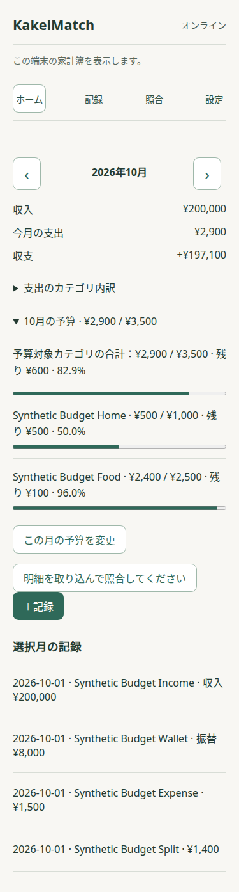

# カテゴリ別の月予算

毎月の基本予算をカテゴリごとに設定し、ホームで選んだ月だけ金額を上書きできます。ホームの月を切り替えると、その月の支出、実効予算、残額、使用率を読み直します。月を表示するだけでは予算を書き換えません。

## 予算額の決まり方

各支出カテゴリについて、選択月の明示的な月別上書きがあればその金額を使います。上書きを基本予算へ戻した月は基本予算を使います。まだ移行されていない既存のActual月予算は、その月だけの上書きとして扱います。月予算がなく、基本予算もないカテゴリは未設定です。既存の月予算から基本予算を推測しません。

「この月の予算を変更」から0円を保存すると、その月だけ予算0円になります。0円予算は未設定とは別の状態として表示されます。ホームで「この月の変更を解除して基本予算へ戻す」を選ぶと、その月の明示的な上書きを解除します。基本予算がなければ未設定へ戻ります。

設定の「予算設定」は毎月の基本予算を編集します。金額欄を空にして解除操作を選ぶと、選択カテゴリの基本予算を解除できます。基本予算の変更はそのカテゴリの全月に適用されます。月別上書きがある月は上書きのままです。

収入カテゴリは予算設定に含めません。カテゴリが非表示になっても設定を保持します。Actualで外部設定された負の月予算は従来どおり表示し、合計額から除外します。予算の繰越、封筒予算、貯蓄目標は扱いません。

## Actualとの互換性

基本予算とKakeiMatchから設定した月別上書きは、端末のLocalDataRepositoryに家計簿IDとカテゴリIDを付けて保存します。通常の予算表示と計算では、このmetadataが明示的に設定した月別金額の正本です。月別上書きはActualの月予算にも反映し、他のActual画面との互換性を保ちます。Actualが0円を月予算の行として保持できない場合も、metadataの0円上書きは残ります。

metadataがない既存月については、Actualの0円以外の月予算を月別上書きとして読み取ります。既存月予算は削除せず、基本予算の候補にも使いません。上書きを解除するとActualの該当月予算を0円にし、基本予算を使う状態をmetadataへ記録します。この記録は、途中で処理が中断しても古いActual月予算が再表示されないようにします。

予算metadataとActualの同期でエラーが起きた場合、画面にエラーを表示します。KakeiMatchの読み取りは保存済みmetadataを使うため、利用者が明示した値を保持します。同じ操作を再試行できます。同期エラーを成功として扱いません。

## 保存とバックアップ

予算metadataは選択中の端末profileとActual家計簿IDごとに保存します。IndexedDB内に残り、ネットワークなしでも使えます。Cloudflareには送信しません。

`.kmb` の書き出しでは現在選択しているActual家計簿の予算metadataを含めます。復元時はActualが新しい家計簿IDを発行するため、検証済みmetadataの関連IDを新しいIDへ付け替えてから保存します。別の家計簿に紐づくmetadataは書き出しません。

## 実績の計算と確認

使用額は月次ダッシュボードと同じ支出実績です。レシート品目でカテゴリを分けた支出は品目ごとに集計し、振替は含めません。予算未設定カテゴリは予算対象の合計から除外します。明示的な0円予算は設定済みとして合計の対象に含め、支出があれば個別行と合計に超過額を表示します。使用率は予算0円では計算しません。

合成データを使う375pxのブラウザー確認では、基本予算の継承、特定月の上書き、0円と解除、月送りの連続操作、再読み込み、オフラインでの編集を確認します。`.kmb` 内の予算値と新しいActual家計簿IDへの付け替えはunit testで確認します。iPhone Home Screen PWAの確認は未実施です。

